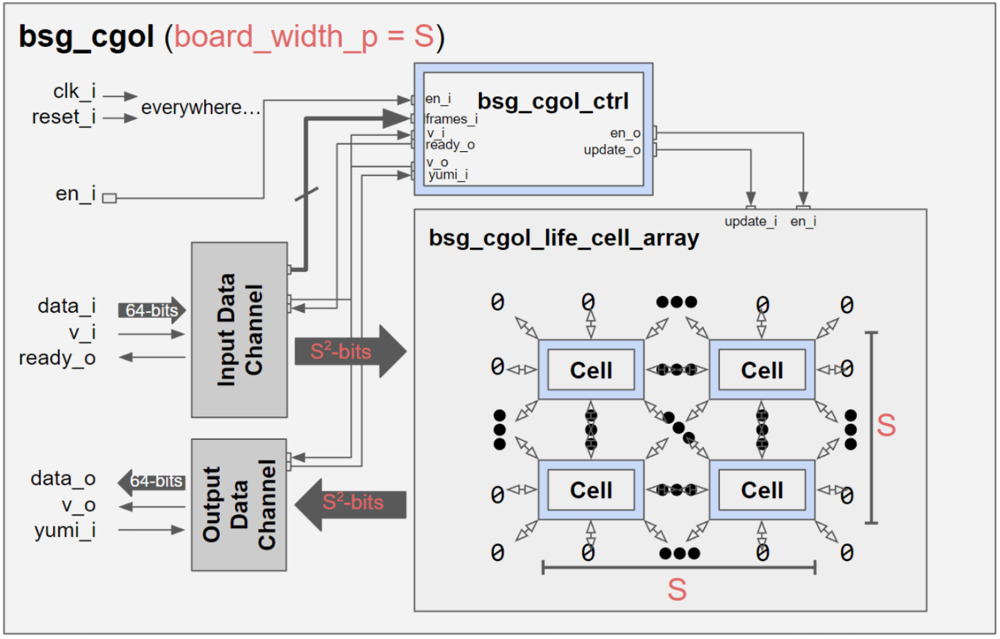

# BSG CGoL Accelerator

## Introduction
This project is a hardware accelerator for Conway's Game of Life (CGoL), implemented using Verilog and synthesized with Cadence Innovus. The design is optimized for a 32x32 board size but is scalable to larger sizes. The accelerator is intended to improve simulation speed compared to software implementations.

## Game Rules
Conway's Game of Life is a cellular automaton where each cell on a 2D grid evolves based on simple rules:
1. **Any live cell with fewer than two live neighbors dies** (underpopulation).
2. **Any live cell with two or three live neighbors survives** to the next generation.
3. **Any live cell with more than three live neighbors dies** (overpopulation).
4. **Any dead cell with exactly three live neighbors becomes alive** (reproduction).

Each update to the board is computed in discrete time steps based on these rules.

## Design Architecture

The accelerator consists of multiple modules that work together to efficiently compute the next state of the board.

### 1. **Cell Array (`bsg_cgol_cell_array.sv`)**
   - A 2D grid of `bsg_cgol_cell` modules, where each cell is a hardware representation of a Game of Life cell.
   - Each cell has an 8-bit input representing its neighboring cells and computes the next state based on the game rules.
   - Cells are arranged with an additional boundary to handle edge conditions.

### 2. **Individual Cell Module (`bsg_cgol_cell.sv`)**
   - Implements the Game of Life rules using a `bsg_popcount` module to count live neighbors.
   - Uses a register (`data_o`) to store the current state and update it on each clock cycle.
   - Has an `update` signal to allow direct initialization of the board.

### 3. **Input & Output Handling (`input_channel.sv`, `output_channel.sv`)**
   - Handles board initialization and result extraction.
   - Uses serial-in-parallel-out (SIPO) and parallel-in-serial-out (PISO) structures to manage data efficiently.

### 4. **Control Unit (`cgol_ctrl.sv`)**
   - Controls the update process and synchronizes data flow between input, cell array, and output.
   - Ensures correct sequencing of cell updates and manages `update_i` and `en_i` signals.
### 5. **Demo**
- gmae size 32x32:

- gmae size 64x64:

## Performance Analysis
- The design is compared against a Python-based implementation.
- Critical path delay and scaling effects are analyzed for different board sizes.
- Place-and-route (P&R) results ensure that timing constraints are met for `core_clk` and `io_clk`.

## Future Improvements
- **Pipeline optimization**: Reduce the critical path delay by breaking down computation further.
- **Memory-efficient design**: Implement hierarchical memory structures for handling larger board sizes.
- **Parallel processing**: Investigate deeper pipelining strategies for faster updates.

## Contributors
- [cyungjen](https://github.com/cyungjen)

## License
This project is open-source and licensed under the MIT License.

